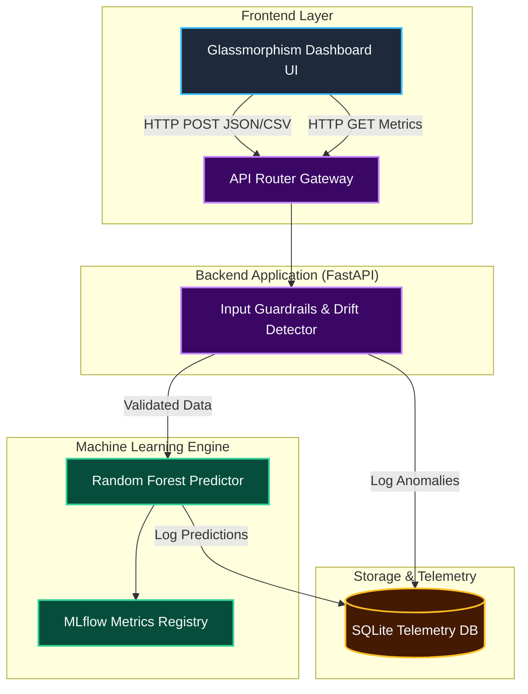
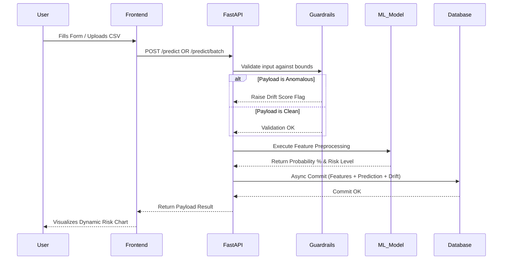

# 🚀 Enterprise Churn Prediction Platform

An end-to-end, production-grade Machine Learning platform designed to predict customer churn in bulk or in real-time. This pipeline integrates an advanced Machine Learning engine with continuous guardrails, tracking telemetry, and a stunning Glassmorphism UI.

## 🌟 Key Features

* **Real-time Inference API:** Lightning fast predictions built with FastAPI and Pydantic validation.
* **Batch Analytics Engine:** Bulk upload CSV capability resolving hundreds of predictions asynchronously.
* **MLflow Tracking & Telemetry:** Built-in experiment tracing mapping accuracy, recall, and precision dynamically.
* **Model Guardrails:** Input validation preventing concept/data drift and detecting statistical anomalies on-the-fly.
* **Production Database Logging:** Every inference seamlessly logs features and results into SQLite for data-lake continuity.
* **Premium Dashboard UI:** Dark-mode glassmorphism aesthetics containing responsive micro-animations and Chart.js interactivity.

---

## 🏗️ High-Level Design (HLD)

The architecture is divided into decoupled micro-services connected via a unified API gateway (FastAPI).



---

## 🧩 Low-Level Design (LLD)

### 1. Data Processing Pipeline (`src/data`)

- **`generate_dataset.py`**: Generates a synthetic but statistically representative 5,000-row telecom dataset.
- **`preprocessing.py`**: Normalizes continuous variables utilizing `StandardScaler` and maps categoricals utilizing `LabelEncoder`, saving models directly to `models/` directory using `joblib`.

### 2. Model Training & Inference (`src/models`)

- **`train.py`**: Initializes an optimized Random Forest estimator. Binds performance metrics (F1, AUC-ROC, Accuracy) natively into MLflow's execution lifecycle.
- **`predict.py`**: Lazy-loads memory-intensive `.pkl` binary artifacts on the first request natively boosting scaling latency. Returns formatted churn risk classes.

### 3. Monitoring & Guardrails (`src/monitoring`)

- **`guardrails.py`**: Compares HTTP request payload schemas against known training bounds globally. Computes a `Drift Score` preventing poisoned data loops.

### 4. Persistence Layout (`src/database`)

- SQLAlchemy ORMs strictly validate data shapes prior to disk commits. Stores granular feature representations natively enabling instant dashboard analytics filtering via `crud.py`.

---

## 🔄 User Workflow Diagram



---

## 📂 Project Structure

```text
Ml_Project/
├── api/                    # FastAPI Backend
│   ├── routes/             # Predict & Dashboard Rest Endpoints
│   ├── schemas.py          # Pydantic Input/Output Validations
│   └── main.py             # Server Entry (Uvicorn)
├── frontend/               # UI Layer
│   ├── css/styles.css      # Glassmorphism/Dark Theme logic
│   ├── js/app.js           # Chart plotting and asynchronous logic
│   └── index.html          # HTML5 Canvas Shell
├── src/                    # Data Science Engine
│   ├── database/           # SQLite ORM & CRUD Operations
│   ├── data/               # Generators and Preprocessing scalers
│   ├── monitoring/         # Guardrails anomaly detection
│   └── models/             # Algorithm tuning and MLflow definitions
├── models/                 # Serialized .pkl binary algorithms
├── mlruns/                 # MLflow Experiment Registry logs
├── notebooks/              # Jupyter Notebooks for local EDA
└── churn.db                # Persistence Database
```

## ⚡ Deployment & Usage Let's Go!

**Create & Activate Environment:**

```bash
python -m venv venv
# On Windows
venv\Scripts\activate
# On Mac/Linux
source venv/bin/activate
```

**Install Requirements:**

```bash
pip install -r requirements.txt
```

**Execute Platform Services:**

```bash
# 1. Generate local testing database
python src/data/generate_dataset.py

# 2. Train and catalog the Random Forest algorithms via MLFlow
python src/models/train.py

# 3. Boot up the Dashboard Application Gateway natively!
python -m uvicorn api.main:app --host 127.0.0.1 --port 8000 --reload
# Or alternately use the provided helper batch script on Windows:
# start_server.bat
```

Enjoy tracking your predictions directly at `http://localhost:8000/`. You can navigate between bulk-processing or live insights tab configurations seamlessly.
