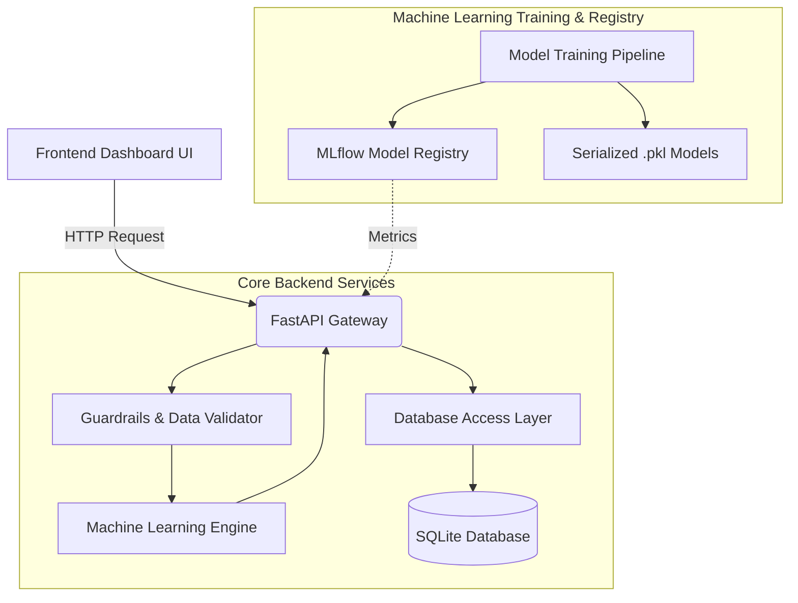

# High-Level Design (HLD)
## Churn Prediction Platform

### 1. Introduction
The **Churn Prediction Platform** is a scalable, AI-driven service designed to predict which customers are most likely to cancel their subscriptions or leave a service. It empowers businesses to take proactive retention strategies.

### 2. Architecture Overview
The platform uses a microservices-inspired architecture pattern internally, separating concerns between Data Handling, Machine Learning inference, API access, and Presentation.

#### 2.1 Component Diagram

### 3. Key Architectural Components

* **Frontend Dashboard (HTML/CSS/JS)**: A single-page application providing rich visual data to the end-users. Built carefully with Vanilla JS to maintain speed without an overwhelming framework payload.
* **FastAPI Gateway (Python)**: Acts as the orchestrator. Takes in user inferences and delegates payload to the model or database endpoints. Validates types explicitly using the `Pydantic` schema validation.
* **Model Inference Engine (Scikit-Learn/Joblib)**: Serves static Binary `.pkl` models via lazy-loading patterns for real-time predictions. 
* **Data Persistence (SQLAlchemy/SQLite)**: The database securely persists all historic predictions. Crucially important for auditing prediction bounds and generating user analytics over time.
* **Metric Registry (MLflow)**: MLflow systematically manages model variations and experimentation runs. Maintains statistical reports directly integrated into the dashboard.

### 4. Guardrails & Security Mechanism
To prevent "Concept Mapping Drift" (where incoming data diverges significantly from training data, causing silent ML failures):
- The `guardrails.py` layer analyzes boundary boxes iteratively for incoming requests. 
- If an income payload exceeds statistically expected bounds, it increases the internal "Drift Score".
- If the Drift Score exceeds parameters, the system raises an `Is_Anomaly` true condition but still returns the payload for database evaluation.
