# Workflow
## End-to-End User Interaction Flow

### 1. The Core Prediction Workflow

This sequence diagram explains exactly how data flows from the end-user (frontend) to the database and prediction engines transparently.

```mermaid
sequenceDiagram
    autonumber
    
    actor User as Business User
    participant App as Frontend Application
    participant API as FastAPI Backend Server
    participant Validator as Input Guardrails
    participant Model as Core ML Engine
    participant DB as SQLite Telemetry Database
    
    User->>App: Submits Form Data (or Bulk CSV)
    App->>API: POST /predict OR POST /predict/batch 
    
    rect rgb(20, 30, 40)
        Note over API, Validator: Validation Layer
        API->>Validator: check_inputs(payload)
        Validator-->>API: Returns drift_score, is_anomaly flags
    end
    
    rect rgb(30, 40, 50)
        Note over API, Model: Prediction Layer
        API->>Model: predict(payload)
        Model-->>API: Returns probability % & churn_risk tier
    end
    
    rect rgb(40, 50, 60)
        Note over API, DB: Persistence Layer
        API->>DB: log_prediction(payload, results, anomalies)
        DB-->>API: Commit Transaction Success
    end
    
    API-->>App: Returns PredictionResponse JSON
    App-->>User: Visualizes Risk in Dashboard Form/File Download
```

### 2. Batch Validation Logic
The batch engine runs asynchronously over CSV documents avoiding timeout blocks explicitly:
- **`batch_predict`**: Processes each row independently parsing through guardrails sequentially preventing total failures by logging individual `-1` errors independently. Outputs cleanly via dynamic `.csv` serialization streaming back via HTTP file attachments gracefully over the network. 

### 3. MLflow Interaction Workflow
To retrieve performance metrics actively:
- The UI triggers `GET /dashboard/mlflow-metrics`.
- The API explicitly bypasses SQLite querying directly against local File-Based MLflow Artifact Directories (`mlruns/`).
- Safely transforms active registry columns securely into JSON configurations mapping natively into `Chart.js` UI definitions perfectly safely.
